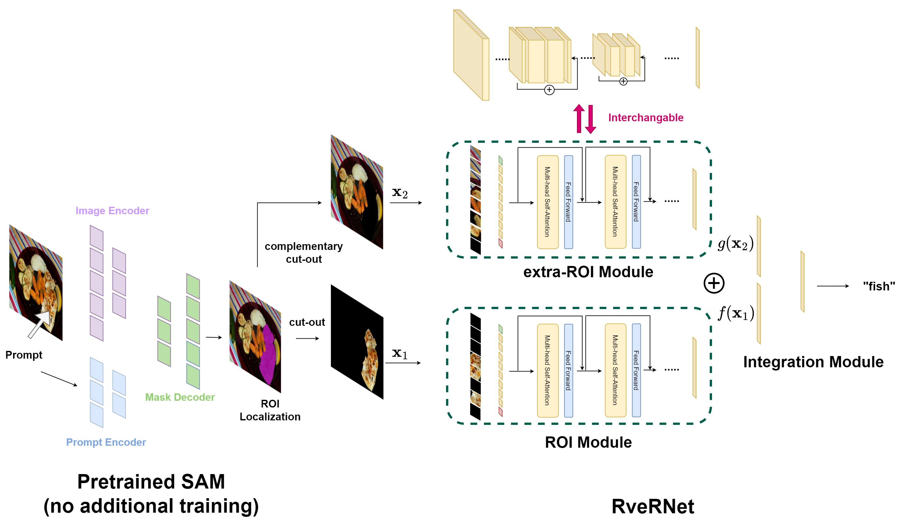

# RveRNet
Official implementation of RveRNet

---

**The structure of the proposed RveRNet** 



We used the robust SAM foundation model to segment the ROI of input images. Then, we processed the images to produce complementary cut-out pairs that were used as inputs for both the ROI and extra-ROI modules. The ROI and extra-ROI modules can have different architectures that encode different inductive biases.

We trained and evaluated our proposed RveRNet on the preprocessed [FoodSeg103 dataset](https://xiongweiwu.github.io/foodseg103.html). To quantify the advantage of our proposed model’s architectures’ unique inductive biases, we avoided selecting a dataset that was too large for fine-tuning. Preprocessing the selected dataset created complementary cut-out images that masked the ROIs and were input into the extra-ROI module while the ROI images were input into the ROI module.

In addition, to determine the degree to which the extra-ROI module in RveRNet enhanced the classification performance of ambiguous foods, we added images of ketchup and chili paste either photographed or collected from the internet, to the dataset. There were 69 ketchup and 72 chili paste train images and 38 ketchup and 34 chili paste test images. Thus, 18,320 train images and 7,769 test images across 105 categories were used in this study.

Unless otherwise specified, the train image dimensions were $224\times 224$ pixels . The off-the-shelf [MobileNetV2](https://arxiv.org/abs/1801.04381), [ViT](https://arxiv.org/abs/2010.11929), [DeiT](https://github.com/facebookresearch/deit/tree/main), [DeiT-distill](https://arxiv.org/abs/2012.12877), and [MLP-Mixer](https://arxiv.org/abs/2105.01601) models were pre-trained on ImageNet-1K for each RveRNet module. We optimized the proposed model’s parameters using the [Adam optimizer](https://arxiv.org/abs/1412.6980), a linear warm-up, and a cosine learning rate decay scheduler. We applied a random horizontal flip to a train set with a 50$\%$ probability. The training batches contained 50 images and had an initial learning rate of $4\times 10^{-3}$. Top-1 accuracy and F1 scores on the test set were calculated for models, which were fine-tuned over 30 epochs using one NVIDIA A100 GPU in [Google Colaboratory Pro](https://colab.research.google.com/).

Here is the structure of [FoodSeg103](https://xiongweiwu.github.io/foodseg103.html) dataset folders:

```bash
FoodSeg103/
   |--Images/
   |    |--ann_dir/
   |    |__img_dir/
   |
   |--ImageSets/
   |    |--test.txt
   |    |__train.txt
   |
   |--category_id.txt
   |--Readme.txt
   |--test_recipe1m_id.txt
   |__train_test_recipe1m_id.txt
```

Your data directory for RveRNet should be like this after preprocessing:

```bash
dataset_root/
    |
    |--train/
    |    |--roi/
    |    |    |--category1/
    |    |    |    |--image_name1.jpg
    |    |    |    |--image_name2.jpg
    |    |    |    |--image_name3.jpg
    |    |    |    |__...
    |    |    |    
    |    |    |--category2/
    |    |    |--category3/
    |    |    |__...
    |    |
    |    |__extra-roi/
    |         |--category1/
    |         |    |--image_name1.jpg
    |         |    |--image_name2.jpg
    |         |    |--image_name3.jpg
    |         |    |__...
    |         |    
    |         |--category2/
    |         |--category3/
    |         |__...
    | 
    |
    |__test/
         |--roi/
         |    |--category1/          
         |    |--category2/
         |    |--category3/
         |    |__...
         |
         |__extra-roi/  
              |--category1/ 
              |--category2/
              |--category3/
              |__...
```

For an off-the-shelf model training, run :

```bash
python3 train_Off-the-shelf.py --config=./Off_the_shelfs/train_cfgs/train_config.yaml
```

For a RveRNet training, run :

```bash
python3 train_RveRNet.py --config=./RveRNets/train_cfgs/train_config_FoodSeg103.yaml
```

---

If you use this code for a paper please cite:

```
@misc{jin2024knowledgedistillationeffectivelyattain,
      title={Knowledge distillation to effectively attain both region-of-interest and global semantics from an image where multiple objects appear}, 
      author={Seonwhee Jin},
      year={2024},
      eprint={2407.08257},
      archivePrefix={arXiv},
      primaryClass={cs.CV},
      url={https://arxiv.org/abs/2407.08257}, 
}
```
